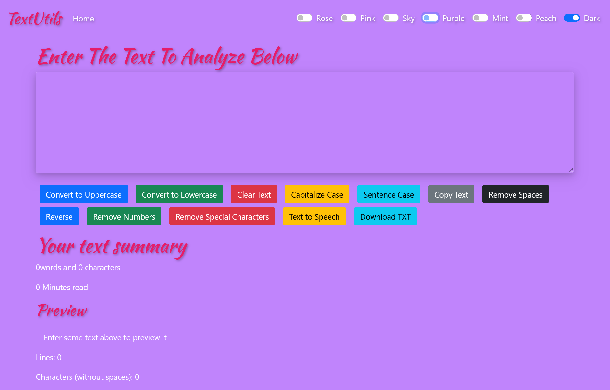
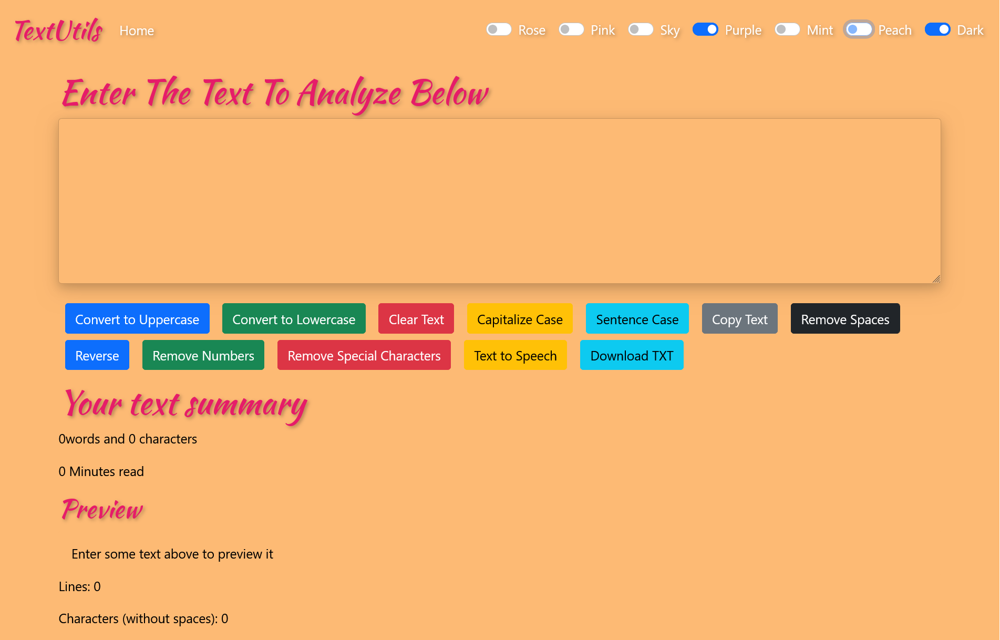

# TextUtils

A modern React-based text utility web application that helps users quickly analyze and modify text.

## Live Demo

🌐 https://vikasp-sw.github.io/textutils/

## Features

* Convert text to UPPERCASE
* Convert text to lowercase
* Remove extra spaces
* Copy text to clipboard
* Character counter
* Word counter
* Reading time estimation
* Multiple theme colors
* Dark Mode support
* Mobile Responsive Design

## Screenshots

### Home Page



### Dark Mode / Theme Preview



## Technologies Used

* React.js
* JavaScript
* Bootstrap 5
* HTML5
* CSS3

## Installation

```bash
git clone https://github.com/VikasP-SW/textutils.git
cd textutils
npm install
npm start
```

## Build

```bash
npm run build
```

## Deploy

```bash
npm run deploy
```

## Author

**Vikas Pawar**

GitHub: https://github.com/VikasP-SW

## License

This project is open source and available under the MIT License.
